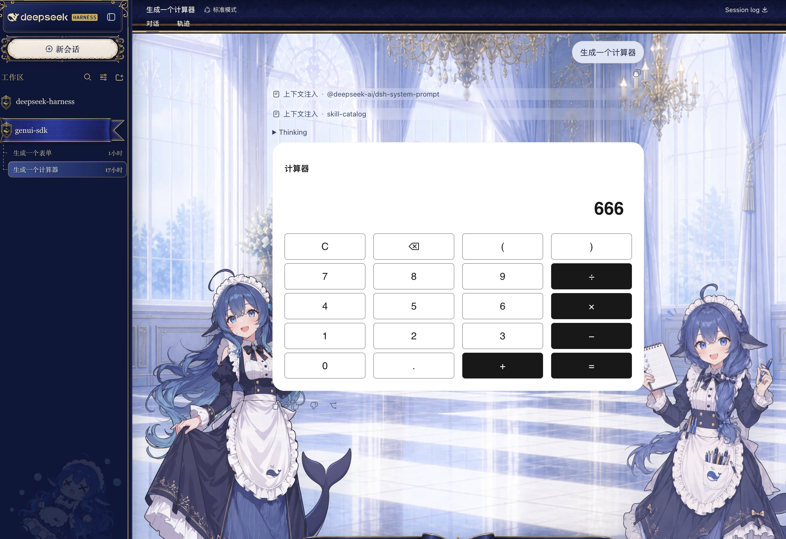
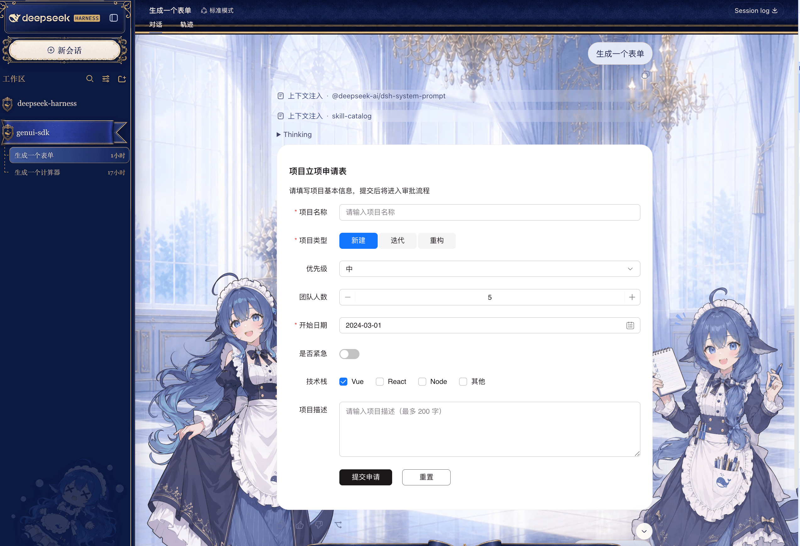
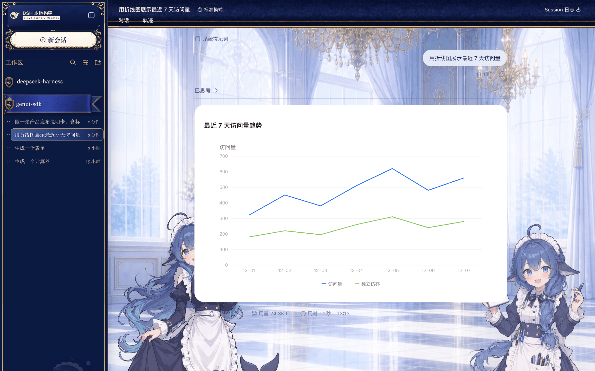

# dsh-genui

[English](https://github.com/lhuans/dsh-genui/blob/main/README.md) · **简体中文**

> 让 [DeepSeek Harness](https://github.com/deepseek-ai/deepseek-harness) 的回答，从「一段文字」变成「一个能点的界面」。

你问 AI「帮我算一下」，它回你一串公式；你说「我要填个申请」，它给你列了八条 Markdown；你说「看看最近七天的访问量」，它把数字排成一张纯文本表格。

内容都对，但你还得自己动手：复制、粘贴、心算、再打一段字告诉它「我选第二个」。

**dsh-genui** 是一个 DeepSeek Harness（下称 DSH）插件。装上之后，同样的问题，AI 的回答里会直接长出一个真的界面——计算器的按键能按，表单的下拉能选，图表的坐标轴是画出来的。你在界面上点完、填完，结果会自动回到对话里，AI 接着往下聊。

装它只要一行命令，不用改 DSH 的任何源码。

---

## 先看三个真实例子

下面三张都是 DSH 里的实际截图，不是效果图。

### 说「生成一个计算器」



数字键、四则运算、括号、退格、清空，全都能按。算出来的 666 是真按出来的，不是 AI 写在文字里的。

### 说「生成一个表单」



一句话生成一整张立项申请表：必填校验、单选按钮组、下拉框、人数步进器、日期选择、开关、多选框、长文本，一次到位。

填完点「提交申请」，你填的内容会带回对话里，AI 可以接着帮你判断优先级、生成排期，或者直接写成一份立项说明。

### 说「用折线图展示最近 7 天访问量」



双折线、图例、坐标轴、网格线，都是渲染出来的图，不是字符画。

---

## 装之前 vs 装之后

| 场景 | 普通对话 | 装了 dsh-genui |
|---|---|---|
| 要一个工具 | AI 给你一段代码，你自己去跑 | 工具直接出现在回答里，当场就能用 |
| 收集信息 | AI 列出「请提供以下 8 项」，你一条条打字 | 一张表单，选完填完点提交 |
| 看数据 | 文本表格，趋势靠脑补 | 折线、柱状、饼图，一眼看出走势 |
| 做选择 | 你回一句「我选 B」 | 点一下按钮，选择自动进入下一轮 |
| 接入成本 | — | 一行 `dsh plugin add`，不动 DSH 源码 |

---

## 你可以让它做什么

只要在对话里正常说人话就行，不需要写任何 JSON、也不用背语法。下面每一类都附了一句可以直接复制的话。

### 看数据：图表

支持柱状图、折线图、饼图、环形图、雷达图、仪表盘、漏斗图、散点图、瀑布图等常见图形。

> 「把这三个季度的营收画成柱状图，顺便标出同比」
>
> 「用饼图看看各渠道的订单占比」
>
> 「做个转化漏斗：曝光 10 万、点击 8 千、下单 600、支付 520」

适合周报、复盘、汇报材料，以及「我懒得开 Excel」的时候。

### 收信息：表单

输入框、多行文本、下拉、单选、多选、开关、数字步进、日期选择、搜索框、穿梭框，都可以生成。提交后内容自动回到对话。

> 「生成一张请假申请表，要有请假类型、起止日期、天数和事由」
>
> 「做个问卷，问用户最常用哪几个功能、满意度打几分」
>
> 「帮我做一个客户信息录入表，手机号必填」

比 AI 追问你八轮舒服得多——一次填完就行。

### 做工具：小应用

这是最好玩的一类。用一句话，让 AI 当场给你造个能用的小东西。

> 「生成一个计算器」
>
> 「做一个 BMI 计算器，输入身高体重直接出结果」
>
> 「做个汇率换算的小工具，人民币和美元互转」
>
> 「弄一个今天的待办清单，可以勾选完成」
>
> 「做一个团队抽奖器，名单我等下给你」

### 理内容：表格、清单、结构

表格（带分页和搜索）、树形目录、时间线、面包屑、标签页、折叠面板、卡片、走马灯、气泡提示。

> 「把这几个方案做成对比表，横向对比价格、周期和风险」
>
> 「按时间线梳理一下这个项目的关键节点」
>
> 「用标签页分开展示前端、后端、测试三块的排期」

### 走流程：多轮交互

界面上的操作会回到对话里，所以可以做「你点一下、我接着干」的流程。

> 「给我三个方案，做成卡片，我点哪个你就展开细化哪个」
>
> 「做个配置向导，一步步问我需求，最后生成配置文件」
>
> 「出五道选择题考考我，我选完你告诉我对错」

### 顺手一提

想不到要什么的时候，直接说「用界面的方式回答我」，AI 会自己判断该用图、用表还是用表单。

---

## 怎么装

### 准备工作

- 装好 Node.js
- 装好 `pnpm`（DSH 管理插件时要用它）。没有的话执行 `corepack enable` 或 `npm i -g pnpm`，然后**新开一个终端**，确认 `pnpm -v` 有输出
- DSH 能跑起来：`npx @deepseek-ai/dsh web`，默认地址 `http://127.0.0.1:3080`

### 方式一：让 AI 帮你装（推荐给不常用命令行的人）

DSH 里的助手本身就能执行终端命令。打开对话，直接跟它说：

> 帮我把 npm 上的 dsh-genui 插件装到 web profile，执行 `dsh plugin --profile web add dsh-genui`

它会把命令跑给你看，中间可能要你点一下确认。跑完之后，按下面「重启」那步操作即可。

### 方式二：自己敲命令

新开一个终端：

```sh
dsh plugin --profile web add dsh-genui
```

这条命令从 npm 公开仓库拉取安装，不需要 npm 账号，也不需要 clone 仓库。

### 装完必须重启（这一步别跳）

DSH 在启动时就锁定了当前的插件集合，所以**装完插件不重启，界面上什么都不会变**。

1. 回到跑着 DSH 的那个终端，按 `Ctrl+C` 停掉
2. 重新启动：`dsh web`
3. 浏览器刷新一下页面
4. **开一个新会话**

### 打开 GenUI 提示词

点击输入框工具行里的星形按钮，开启 GenUI 授权提示词。DSH 重启或插件重新加载后，开关默认关闭；它只控制发给模型的提示词，卡片渲染能力始终保留。

### 验证装好了没

在新会话里说一句：

> 生成一个计算器

如果回答区域直接出现一个能按的计算器，就成了。如果只看到一段代码块，说明插件没生效，往下看「常见问题」。

想在重启前先确认一下，可以执行：

```sh
dsh --profile web --dump-config
```

输出里应该能看到 `dsh-genui` 这一层。

### 不想要了

```sh
dsh plugin --profile web remove dsh-genui
```

同样需要重启 DSH 才会生效。

---

## 常见问题

**装完还是显示成代码块？**

九成是没重启，或者还在用旧会话。按上面「装完必须重启」的四步走一遍：停服务 → 重启 → 刷新浏览器 → 开新会话。

**提示 `pnpm not found on PATH`？**

DSH 管理插件依赖 pnpm。执行 `corepack enable`（或 `npm i -g pnpm`）之后，**新开一个终端**再试，因为 PATH 在旧终端里不会更新。

**AI 不主动用界面回答？**

如果星形开关是关闭的，模型不会收到 GenUI 提示词。先打开开关，再说一句「用界面/表单/图表的方式给我」就行。

**会不会影响原来的用法？**

不会。不需要界面的问题，AI 照常用文字回答，和以前一模一样。

**卸载干净吗？**

`dsh plugin remove` 之后重启，DSH 完全恢复原样，不留残留配置。

---

## 它是怎么做到的

一句话：AI 不再只写文字，它还会写一段「界面描述」，浏览器把这段描述渲染成真正的组件。

具体一点：输入框开关打开时，插件给模型加一段提示词，教它在需要的时候输出一段结构化的 JSON（写在 `schemaJson` 代码块里）；DSH 网页端拿到这段 JSON 后，交给渲染器变成实际组件。整个过程是流式的，AI 写到哪、界面就渲染到哪，不用等它把话说完。

组件本身来自 [OpenTiny GenUI SDK](https://opentiny.design/genui-sdk) 和 OpenTiny Vue 组件库——这是 OpenTiny 团队做的生成式 UI 方案，一整套「让大模型输出界面」的规范和渲染引擎。dsh-genui 做的事情，是把它接到了 DSH 的对话流里。

顺带说一句安全：模型能用的组件是白名单里的那些，它塞不进 HTML 或脚本，所以不用担心对话里跑出奇怪的东西。

---

## 相关链接

- 更新记录：<https://github.com/lhuans/dsh-genui/releases>
- npm 包：<https://www.npmjs.com/package/dsh-genui>
- OpenTiny GenUI SDK：<https://github.com/opentiny/genui-sdk>
- DeepSeek Harness：<https://github.com/deepseek-ai/deepseek-harness>

License: MIT

---

DSH 管好了 Agent、会话和工具，dsh-genui 补上最后一段：让模型的回答不只是能读，还能点。

一行命令，重启一次，然后跟它说「生成一个计算器」——三十秒就能看到区别。
